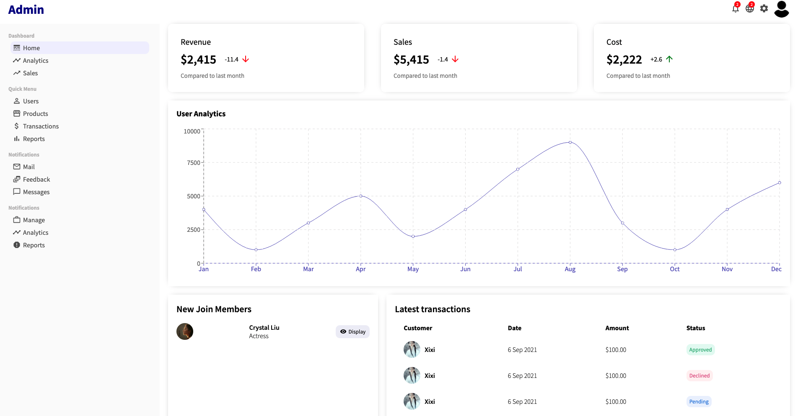

# MERN-E_Commerce

```
cd client && npm install && npm start
cd admin && npm install && npm start
cd server && npm install && npm run devStart
```

It is an admin panel design using React, Recharts, Material UI, and CSS. There are some widgets showing
some sales information, new members and latest transactions. The analytic chart displays active users monthly.

Visit: https://backend-dashboard.netlify.app/